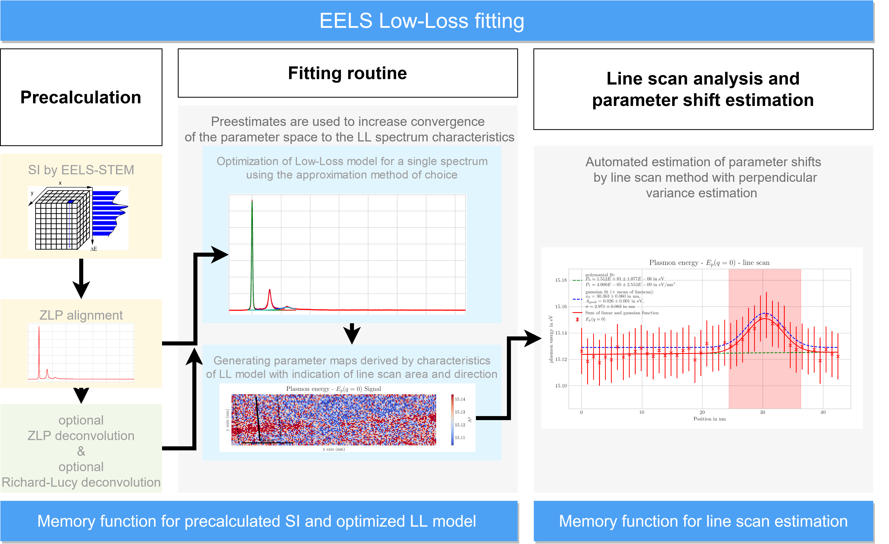

<!--
*** Credits here go to : othneildrew/Best-README-Template for the awesome README Template
*** Thanks for checking out this README Template. If you have a suggestion that would
*** make this better, please fork the repo and create a pull request or simply open
*** an issue with the tag "enhancement".
*** Thanks again! Now go create something AMAZING! :D
-->


<!-- PROJECT SHIELDS -->
<!--
*** I'm using markdown "reference style" links for readability.
*** Reference links are enclosed in brackets [ ] instead of parentheses ( ).
*** See the bottom of this document for the declaration of the reference variables
*** for contributors-url, forks-url, etc. This is an optional, concise syntax you may use.
*** https://www.markdownguide.org/basic-syntax/#reference-style-links
-->

<!-- PROJECT LOGO -->
<br />
<p align="center">
  <a href="https://github.com/mgrove-wwu/EELS-LL-image-fitting/">
    
  </a>

  <h3 align="center">EELS Low-Loss image fitting</h3>
  </p>
</p>


<!-- TABLE OF CONTENTS -->
## Table of Contents

* [About the Project](#about-the-project)
  * [Built With](#built-with)
* [Getting Started](#getting-started)
  * [Prerequisites](#prerequisites)
  * [Installation](#installation)
* [Usage](#usage)
* [Contributing](#contributing)
* [License](#license)
* [Contact](#contact)
* [Acknowledgements](#acknowledgements)


<!-- ABOUT THE PROJECT -->
## About The Project


This python module includes 4 different models and supports 3 different types of optimization routines to fit the models to a low-loss EELS spectrum image generated by using STEM-EELS. The fitted models can then be further investigated by using rectangular and line ROI's. The full support for the line ROI automatically fits and estimates parameter shifts of the model in use. Afterwards an indication the ROI is done by simple line markers.

The class mainly uses HyperSpy (a multi-dimensional data analysis toolbox) as the underlying python module to investigate the spectrum image and the estimation of parameter shifts (e.g. peak center, full-width-half-maxima, peak intensity, ...). It supports error estimations by spatial variance and fitting estimations during minimization using weighted Least-Squared, a MP-Fit approach or a Maximum-Likelyhood minimization to fit the low-loss model to the data of the spectrum image.

For further information on all functions and parameters used, see (http://hyperspy.org/hyperspy-doc/current/index.html - doi:10.5281/zenodo.3396791) as well as (https://www.scipy.org/docs.html) and (https://docs.dask.org/en/latest/) which i want to say a special thank you and i want to recommend their work strongly!
A list of commonly used resources that I find helpful are listed in the acknowledgements.

### Built With
* [Hyperspy](https://hyperspy.org)
* [Scipy](https://scipy.org)
* [Numpy](https://numpy.org)
* [Dask](https://dask.org)

## Getting started

### Prerequisites

A python environment is required.
The anaconda distribution is recommended:

* [Anaconda](https://www.anaconda.com/distribution/)

### Installation

To install the environment used for the eif-class developed for hyperspy, the environment file for the anaconda distribution is added to make the installation process user friendly and minimize possible mistakes during the installation process. For more information on anaconda see: https://docs.conda.io/projects/conda/en/latest/user-guide/

For the usage of the environment.yml the anaconda management system for python environments is recommended. You can download anaconda from directly from their homepage (Linux, Windows and macOS supported): https://www.anaconda.com/distribution/?gclid=EAIaIQobChMI8uCGiJ6X5wIViK3tCh3XhgvyEAAYASAAEgKc9vD_BwE#download-section

ATTENTION: Currently, the displayed installation commands do not work with the new setup. Testing for a working installation process. I will update as soon as possible. Apologies for any issues you are experiencing.
If a fresh anaconda distribution is installed the following 6 commands will create an environment called `HyperSpy` and install all required modules inside the activated environment for the developed python class:

```
conda create --name HyperSpy
conda activate HyperSpy
conda install hyperspy[all] -c conda-forge 

conda install mayavi -c conda-forge
conda install opencv -c conda-forge 
conda install mendeleev -c conda-forge  
```

As an alternative way to install the required python environment can be done from a single file.
The step to install the environment from the `environment.yml` file for anaconda is as follows:

```
conda env create -f /path/to/environment.yml
```

Downloading the environment.yml file and executing the command may take some time, which can be filled by a coffee break. ;)

If required, one can setup the python environment via pip, using the txt file including all python modules and the corresponding versions. Only recommended for advanced users.

<!-- USAGE EXAMPLES -->
## Usage

After installation, the execution of the python class just takes two further steps:
The first step is to download the EELS fitting class `pl_analysis.py` and the corresponding exemplatory evaluation script `Notebook_for_pl_analysis.ipynb`/`Evaluation.ipynb` to a path of your decision. For the full analysis jupyter notebook was used, which will be recommended here specifically to make the execution process user friendly. It is automatically included in the Hyperspy-environment installed from the `environment.yml` file.
The second step is to start the jupyter notebook in your browser and to navigate to the path to your chosen folder for  `pl_analysis.py` and start the first cell of  `Notebook_for_pl_analysis.ipynb`/`Evaluation.ipynb` which should be located in the same path.

Further navigation is not required as it was automated by the python class.

The pl_analysis.py can easily be edited and changed to specific user demands and further automation can be included.

<!-- CONTRIBUTING -->
## Contributing

Contributions are what make the open source community such an amazing place to be learn, inspire, and create.
I want to list a few names, which helped me a lot during the work presented here:
Prof. Dr. Gerhard Wilde
Dr. Harald Rösner
Dr. Martin Peterlechner

<!-- LICENSE -->
## License

Distributed under the GPL3 License.


<!-- CONTACT -->
## Contact

Project Link: [https://github.com/mgrove-wwu/EELS-LL-image-fitting](https://github.com/mgrove-wwu/EELS-LL-image-fitting)


<!-- ACKNOWLEDGEMENTS -->
## Acknowledgements

A short thanks shall be noted here to:
Prof. Dr. Gerhard Wilde
Dr. Harald Rösner
Dr. Martin Peterlechner

Additionally, i want to mention the HyperSpy team in general as i received quite a few tipps and a lot of additional information thanks to these guys! To be more specific a thanks goes to the github issues page of their project:
[issues-url]: https://github.com/hyperspy/hyperspy/issues

Furthermore i want to appreciate all the help I received from my collegues:
Marius Gerlitz
Mirko Gabski
Sven Hilke
Farnaz Davani


## Misc.

If any help is needed or any issue is occuring, the issues forum of github under the link https://github.com/mgrove-wwu/EELS-LL-image-fitting/issues can be used to inform me for bug hunting and further support.
